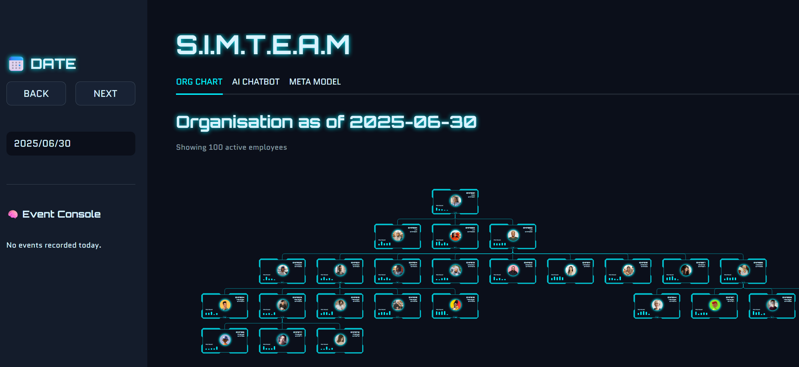

<div align="center">
  <a href="https://simteam.danielpham.com.au/">
    
  </a>
</div>
<div align="center">
  <em>Simulate. Predict. Explain. Optimise.</em>
</div>

---

### 🧠 S.I.M.T.E.A.M

A full-stack analytics & AI platform for organisational design, built with commercial-grade technologies and shaped by real enterprise experience. 

_A personal project by © 2025 Daniel Pham._

---

## Includes

* A **simulation engine** for modelling hiring, promotion, attrition, and succession
* A **live PostgreSQL backend** accessed through a typed API layer
* A **stateless natural language assistant** that converts plain English into secure SQL queries
* A **machine learning meta-model** to approximate simulation outcomes using AutoML
* An **interactive frontend** combining Streamlit with a custom React org chart

---

## System Overview


| Component             | Description                                                                |
| --------------------- | -------------------------------------------------------------------------- |
| **Simulation Engine** | Modular OOP logic to simulate daily events affecting workforce structure   |
| **API Layer**         | FastAPI app with versioned, schema-validated endpoints (`/api/v1/...`)     |
| **Database**          | PostgreSQL with SQLAlchemy ORM and typed model access                      |
| **LLM Assistant**     | PydanticAI agent that executes validated SQL queries from natural language |
| **Meta Model**        | Surrogate model trained via FLAML to predict simulation outcomes           |
| **Frontend**          | Streamlit + React (d3-org-chart) for dynamic organisational visualisation  |
| **Deployment**        | Dockerised stack deployed to GCP Cloud Run with NGINX reverse proxy        |

---

## Key Interface Features

### Organisation Chart

Displays a point-in-time hierarchy built from a transactional event log. Supports drilldowns and metadata display using a custom React wrapper around `d3-org-chart`.

### AI Assistant

Natural language interface backed by PydanticAI. Key properties:

* Stateless: no memory or chaining
* Read-only: rejects `INSERT`, `UPDATE`, `DELETE`
* Transparent: shows generated SQL for inspection
* Integrated with the live PostgreSQL instance

### Meta Model

Trains surrogate models from simulation logs to predict:

* Total employees at horizon
* Promotion or churn counts
* Impact of parameter changes on structure

Powered by FLAML for lightweight hyperparameter tuning.

### Time Series and Logs

* Daily event log with console-like view
* Employee count time series with simulation trace
* Sidebar-driven filtering and playback

---

## Simulation Logic

The simulation is modular and rule-based. Logic modules include:

* `HiringLogic`: Validates manager availability and department context
* `PromotionLogic`: Uses weighted sampling and eligibility checks
* `ManagerChangeLogic`: Prevents circular reporting and ensures role hierarchy
* `VacancyLogic`: Auto-generates TEMP nodes for unmet quotas

Simulation adheres to a 6-tier hierarchy:

`CEO → VP → Director → Manager → Senior Analyst → Analyst`

All logic is housed in [`simteam/core`](simteam/core), with Pydantic-based data models for simulation state and events.

---

## Architecture

```
simteam/
├── core/                  # Simulation engine: OOP logic + data models
├── server/                # FastAPI routers and database interface
├── ui/                    # Streamlit frontend + PydanticAI integration
│   └── components/
│       └── org_chart_component/   # React component
├── automl/                # Surrogate model training and inference
├── training_data/         # Cached simulation outputs
├── nginx/                 # Reverse proxy config
└── Dockerfile             # Container setup for GCP/Cloud Run
```

---

## Running Locally

```bash
# Backend API
uvicorn simteam.server.main:app --reload

# Frontend
streamlit run simteam/ui/main.py

# Org chart component
cd simteam/ui/components/org_chart_component
npm install
npm run build
```

---

## Deployment

* Dockerised application for local or cloud use
* Designed for GCP Cloud Run + Cloudflare Load Balancer
* NGINX reverse proxy with env-based dynamic configuration

---

## Usage Guidelines

* Use the sidebar to explore historical org snapshots by date
* Ask natural language questions (e.g. “Who was promoted last week?”)
* Simulate future scenarios and compare with surrogate predictions
* Use SQL inspector to verify query safety and transparency

---

## Planned Enhancements

* Time-lapse animation of org structure
* Scenario comparison and optimisation dashboard
* Export features (PDF/CSV)
* Role-based user views (admin vs analyst)
* Query intent classification for routing
* Team-level KPIs and dashboards

---

## More from me

http://danielpham.com.au/

http://github.com/danieltpham/